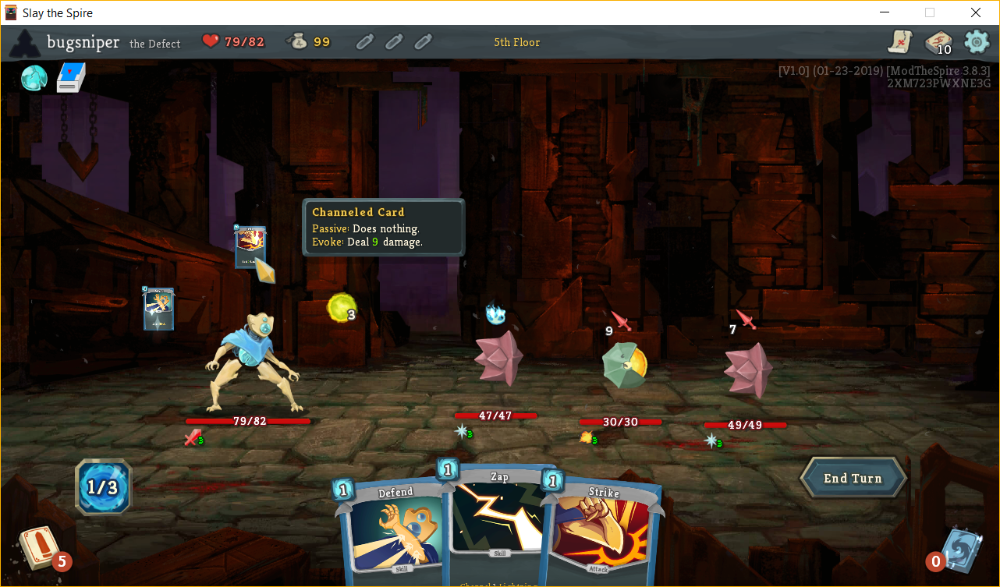

# card-channel-mod
A Slay the Spire mod that allows you to channel cards into your orb slots. Channeled cards are unaffected by focus and have no passive effect. When they are evoked, the card is played for free; the casting cost is paid instead when the card is channeled. The exception is cards with an X casting cost, which eat up all your remaining energy when they are evoked.

